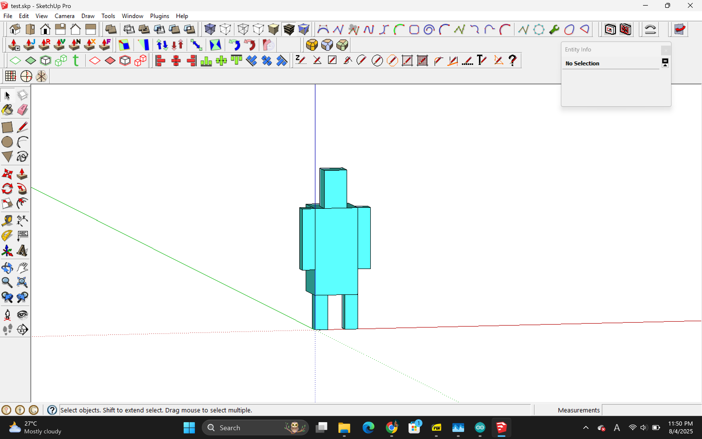

# 8/4

 - Arduino Basics

→ Learned Digital Inputs
```
    // constants won't change. They're used here to set pin numbers:
    const int buttonPin = 2;     // the number of the pushbutton pin
    const int ledPin =  13;      // the number of the LED pin
    
    // variables will change:
    int buttonState = 0;         // variable for reading the pushbutton status
    
    void setup() {
      // initialize the LED pin as an output:
      pinMode(ledPin, OUTPUT);
      // initialize the pushbutton pin as an input:
      pinMode(buttonPin, INPUT);
    }
    
    void loop() {
      // read the state of the pushbutton value:
      buttonState = digitalRead(buttonPin);
    
      // check if the pushbutton is pressed. If it is, the buttonState is HIGH:
      if (buttonState == HIGH) {
        // turn LED on:
        digitalWrite(ledPin, HIGH);
      } else {
        // turn LED off:
        digitalWrite(ledPin, LOW);
      }
    }
```
→ Learned Analog Inputs and Libraries (And also some debugging & syntax)

Debugging
```
void setup() {
  // initialize serial communication at 9600 bits per second:
  Serial.begin(9600);
}

// the loop routine runs over and over again forever:
void loop() {
  // read the input on analog pin 0:
  int sensorValue = analogRead(A0);
  // print out the value you read:
  Serial.println(sensorValue);
  delay(1);        // delay in between reads for stability
}
```
Analog Inputs + rgb lights
```
#include <Adafruit_NeoPixel.h>
#ifdef __AVR__
 #include <avr/power.h> // Required for 16 MHz Adafruit Trinket
#endif
#define PIN 13
#define NUMPIXELS 3
Adafruit_NeoPixel pixels(NUMPIXELS, PIN, NEO_GRB + NEO_KHZ800);
#define DELAYVAL 500
void color(uint16_t pixelIndex, uint8_t red, uint8_t green, uint8_t blue) {
  pixels.setPixelColor(pixelIndex, pixels.Color(red, green, blue));
}
void setup() {
#if defined(__AVR_ATtiny85__) && (F_CPU == 16000000)
  clock_prescale_set(clock_div_1);
#endif
  pixels.begin();
 pinMode(A0, INPUT);
}

void loop() {
  int raw = analogRead(A0);
  int scrollValue = map(raw, 0, 1023, 0, 255);
  color(0, scrollValue, 0, 0);
  color(1, 0, scrollValue, 0);
  color(2, 0, 0, scrollValue);
  pixels.show();
}
```

 - Sketchup Pro Basics
 
