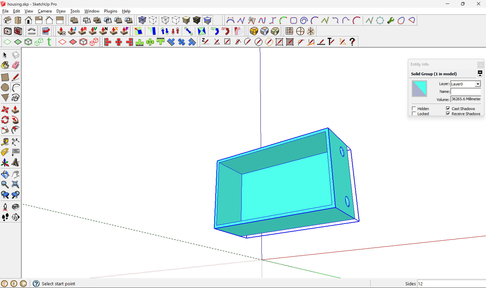
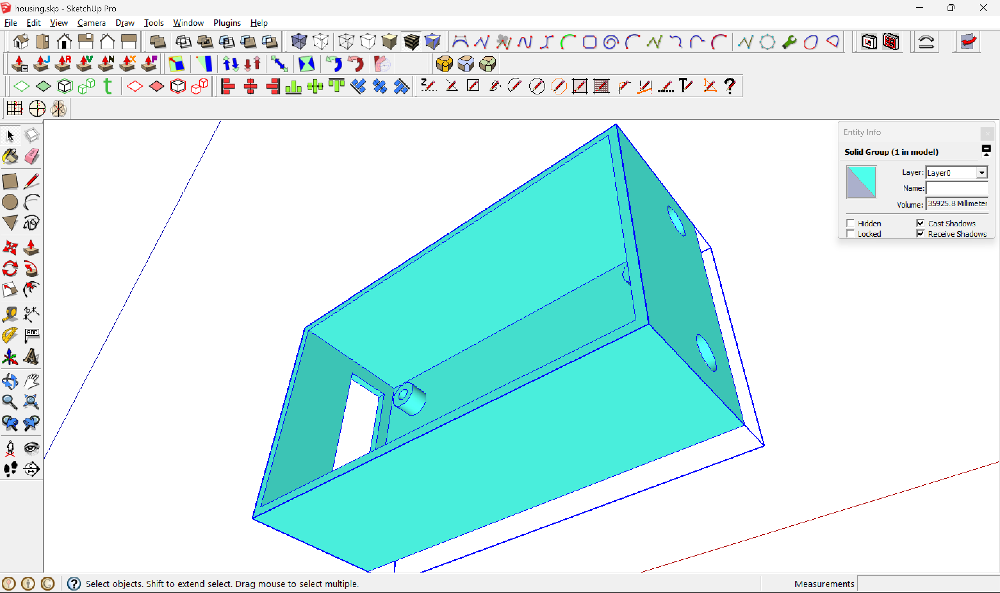
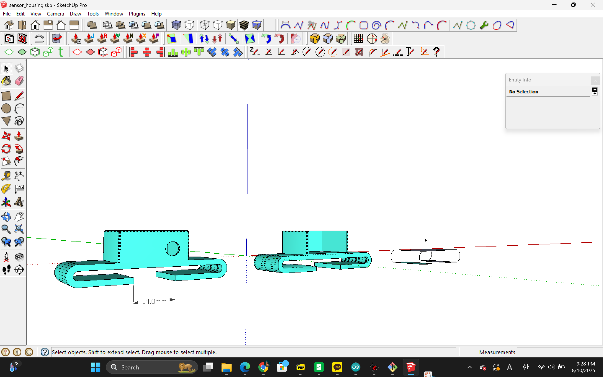
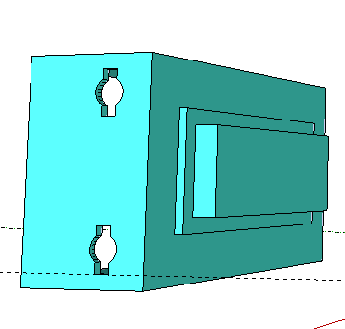
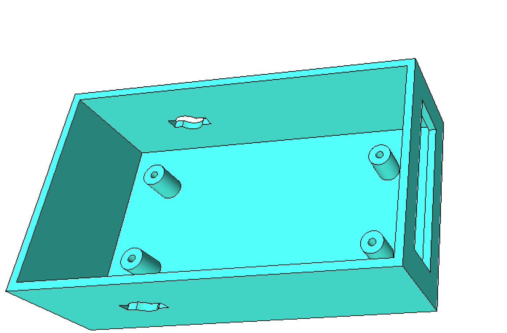
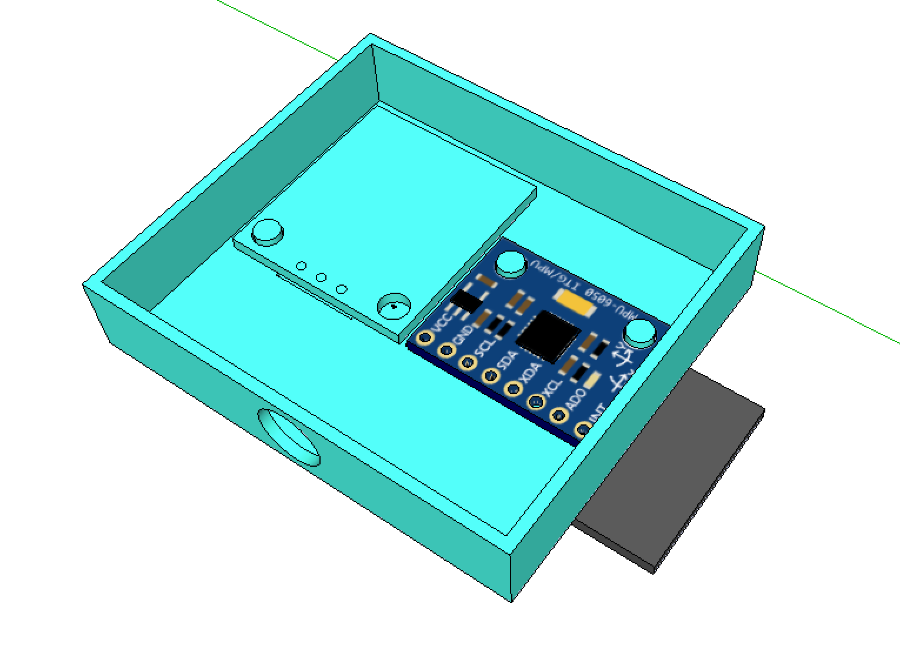
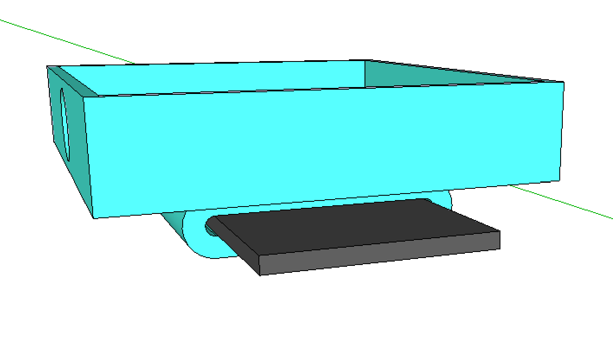

# Introduction
Hi, this is my project where I try to make a device that tracks your movement with information from a mix of accelerometers and gyroscopes (linear acceleration and radial acceleration) to track arm swings. 

So, why did I start this project?

Let's start from the beginning.
I do this activity at Namsan Mountain where I run with visually impaired runners with a running tether. 


It keeps the visually impaired runner parallel to the volunteer (me) and lets me pull the runner in case of any obstacles / people. 
Most tethers (all tethers I've seen) are inelastic, thus the blind runners naturally doesn't swing the arm that's tied.
It would be fine if the blind runners switched their tether arm every run, but most runners just make it a habit of using the tether on the same arm always.
Keep running with this habit can become a cause for unbalanced posture.
I didn't notice it in my 2 years of running with visually impaired runners.
But my mom did when she took a look at a group photo that was taken at the event.
Thinking about it, I found out that the blind have a higher COG (center of gravity) velocity ([https://doi.org/10.1002/brb3.1436](https://doi.org/10.1002/brb3.1436)), and thus were more susceptible to bad posture.
This started my journey to find a device to give feedback to blind runners to promote balanced posture through equalizing left and right arm swings (both count and distance).


# 8/4

 - Arduino Basics

→ Learned Digital Inputs
```
    // constants won't change. They're used here to set pin numbers:
    const int buttonPin = 2;     // the number of the pushbutton pin
    const int ledPin =  13;      // the number of the LED pin
    
    // variables will change:
    int buttonState = 0;         // variable for reading the pushbutton status
    
    void setup() {
      // initialize the LED pin as an output:
      pinMode(ledPin, OUTPUT);
      // initialize the pushbutton pin as an input:
      pinMode(buttonPin, INPUT);
    }
    
    void loop() {
      // read the state of the pushbutton value:
      buttonState = digitalRead(buttonPin);
    
      // check if the pushbutton is pressed. If it is, the buttonState is HIGH:
      if (buttonState == HIGH) {
        // turn LED on:
        digitalWrite(ledPin, HIGH);
      } else {
        // turn LED off:
        digitalWrite(ledPin, LOW);
      }
    }
```
→ Learned Analog Inputs and Libraries (And also some debugging & syntax)

Debugging
```
void setup() {
  // initialize serial communication at 9600 bits per second:
  Serial.begin(9600);
}

// the loop routine runs over and over again forever:
void loop() {
  // read the input on analog pin 0:
  int sensorValue = analogRead(A0);
  // print out the value you read:
  Serial.println(sensorValue);
  delay(1);        // delay in between reads for stability
}
```
Analog Inputs + rgb lights
```
#include <Adafruit_NeoPixel.h>
#ifdef __AVR__
 #include <avr/power.h> // Required for 16 MHz Adafruit Trinket
#endif
#define PIN 13
#define NUMPIXELS 3
Adafruit_NeoPixel pixels(NUMPIXELS, PIN, NEO_GRB + NEO_KHZ800);
#define DELAYVAL 500
void color(uint16_t pixelIndex, uint8_t red, uint8_t green, uint8_t blue) {
  pixels.setPixelColor(pixelIndex, pixels.Color(red, green, blue));
}
void setup() {
#if defined(__AVR_ATtiny85__) && (F_CPU == 16000000)
  clock_prescale_set(clock_div_1);
#endif
  pixels.begin();
 pinMode(A0, INPUT);
}

void loop() {
  int raw = analogRead(A0);
  int scrollValue = map(raw, 0, 1023, 0, 255);
  color(0, scrollValue, 0, 0);
  color(1, 0, scrollValue, 0);
  color(2, 0, 0, scrollValue);
  pixels.show();
}
```

 - Sketchup Pro Basics
 

# 8/5
- Arduino coding

Simple double integration model to track motion (print distance every 200ms)
```
#include <Adafruit_MPU6050.h>
#include <Adafruit_Sensor.h>
#include <Wire.h>

Adafruit_MPU6050 mpu;

// ---- calibration storage ----
float axBias = 0, ayBias = 0, azBias = 0;

// ---- state variables ----
float vx = 0, vy = 0, vz = 0;   // velocity (m/s)
float px = 0, py = 0, pz = 0;   // position (m)
unsigned long lastMicros = 0;

void setup() {
  Serial.begin(115200);
  Wire.begin(21, 22);           // LOLIN-D32 default I²C
  if (!mpu.begin()) {
    Serial.println("MPU6050 not found!"); while (1) delay(10);
  }
  mpu.setAccelerometerRange(MPU6050_RANGE_8_G);
  mpu.setFilterBandwidth(MPU6050_BAND_21_HZ);

  Serial.println("\n*** Keep the board STILL for 2 s — calibrating… ***");
  const int N = 400;            // 2 s at 200 Hz
  sensors_event_t a, g, t;
  for (int i = 0; i < N; ++i) {
    mpu.getEvent(&a, &g, &t);
    axBias += a.acceleration.x;
    ayBias += a.acceleration.y;
    azBias += a.acceleration.z - 9.80665;  // remove gravity on Z
    delay(5);
  }
  axBias /= N; ayBias /= N; azBias /= N;
  Serial.println("Calibration done.\n");

  lastMicros = micros();
}

void loop() {
  // -------- time step --------
  unsigned long now = micros();
  float dt = (now - lastMicros) * 1e-6;   // s
  lastMicros = now;

  // -------- read accel --------
  sensors_event_t a, g, t;
  mpu.getEvent(&a, &g, &t);
  float ax = a.acceleration.x - axBias;
  float ay = a.acceleration.y - ayBias;
  float az = a.acceleration.z - azBias;

  // -------- integrate --------
  vx += ax * dt;
  vy += ay * dt;
  vz += az * dt;

  px += vx * dt;
  py += vy * dt;
  pz += vz * dt;

  // -------- print every 200 ms --------
  static unsigned long lastPrint = 0;
  if (millis() - lastPrint >= 200) {
    lastPrint = millis();
    Serial.print("ΔPos X: "); Serial.print(px, 4);
    Serial.print("  Y: ");    Serial.print(py, 4);
    Serial.print("  Z: ");    Serial.print(pz, 4);
    Serial.println("  (m)");
  }
}
```
This time a different approach:
Counts arm swing count by using IMU sensors (MPU6050)
Also has an automatic 2-second gyro sensor calibration period
```
#include <Adafruit_MPU6050.h>
#include <Adafruit_Sensor.h>
#include <Wire.h>

#define SDA_PIN          21
#define SCL_PIN          22
#define SAMPLE_RATE_HZ   250          // loop target ≈ 4 ms
#define GYRO_THRESH      1.2f         // rad/s   (swing detected when |ωz| crosses this)
#define RADIUS_DEFAULT   0.30f        // m       (fore-arm length – user adjustable)
#define CALIB_TIME_MS    2000         // how long to average gyro bias

Adafruit_MPU6050 mpu;

/* ------------------------ runtime state ------------------------ */
float gzBias = 0.0f;                  // gyro Z bias (rad/s)
float radius = RADIUS_DEFAULT;        // swing radius (m)

float angleZ = 0.0f;                  // integrated θ (rad) – continuous
bool  inSwing = false;                // currently inside a swing?
int   dir      = 0;                   // +1 forward, -1 backward
float swingStartAngle = 0.0f;         // θ at swing start
uint32_t swingCount = 0;

uint64_t lastMicros = 0;

/* ----------------------------- helpers ----------------------------- */
void calibrateGyro()
{
  Serial.println(F("\n*** Keep sensor STILL – calibrating gyro (2 s)… ***"));
  delay(500);
  const uint32_t t0 = millis();
  uint32_t samples = 0;
  float sum = 0.0f;
  sensors_event_t a, g, t;
  while (millis() - t0 < CALIB_TIME_MS) {
    mpu.getEvent(&a, &g, &t);
    sum += g.gyro.z;
    ++samples;
    delay(4);
  }
  gzBias = sum / samples;
  Serial.print(F("Gyro Z bias = "));
  Serial.print(gzBias, 6);
  Serial.println(F(" rad/s"));
  angleZ = 0; inSwing = false; dir = 0;
}

void processSerial()
{
  if (!Serial.available()) return;
  char c = Serial.read();
  if (c == 'r')            calibrateGyro();               // recalibrate bias
  else if (c == 'd') {                                   // set new radius
    float newR = Serial.parseFloat();
    if (newR > 0.05 && newR < 1.0) {
      radius = newR;
      Serial.print(F("Swing radius set to "));
      Serial.print(radius * 100.0f, 1);
      Serial.println(F(" cm"));
    }
  }
}

/* ----------------------------- setup ----------------------------- */
void setup()
{
  Serial.begin(115200);
  Wire.begin(SDA_PIN, SCL_PIN);
  if (!mpu.begin()) { Serial.println(F("MPU6050 not found!")); while (1) delay(10); }

  mpu.setGyroRange(MPU6050_RANGE_500_DEG);      //  ±500 °/s  ≈ 8.73 rad/s
  mpu.setFilterBandwidth(MPU6050_BAND_21_HZ);   //  basic LPF

  calibrateGyro();
  lastMicros = micros();

  Serial.println(F("\nSend ‘r’ to recalibrate bias, ‘d <value>’ to set radius in metres\n"));
}

/* ----------------------------- loop ----------------------------- */
void loop()
{
  /* ----- timing ----- */
  uint64_t now = micros();
  float dt = (now - lastMicros) * 1e-6f;
  lastMicros = now;

  /* ----- read IMU ----- */
  sensors_event_t a, g, t;
  mpu.getEvent(&a, &g, &t);
  float wz = g.gyro.z - gzBias;        // rad/s  (Z-axis angular velocity)

  /* ----- integrate θz ----- */
  angleZ += wz * dt;                   // rad (unbounded)

  /* ----- swing detection FSM ----- */
  if (!inSwing) {
    /* detect start: |ω| crosses threshold */
    if (fabsf(wz) > GYRO_THRESH) {
      inSwing           = true;
      dir               = (wz > 0) ? 1 : -1;
      swingStartAngle   = angleZ;
    }
  }
  else {
    /* detect end: sign reversal AND exceeded threshold in opposite dir */
    if ((dir ==  1 && wz < -GYRO_THRESH) ||
        (dir == -1 && wz >  GYRO_THRESH)) {
      float swingEndAngle = angleZ;
      float deltaTheta    = swingEndAngle - swingStartAngle;   // rad (can be ±)
      float arcLen        = fabsf(deltaTheta) * radius;        // m

      ++swingCount;
      Serial.print("Swing #");  Serial.print(swingCount);
      Serial.print(" │ Angle: "); Serial.print(fabsf(deltaTheta) * 57.29578f, 1); Serial.print(" deg");
      Serial.print(" │ Length: "); Serial.print(arcLen * 100.0f, 1); Serial.println(" cm");

      /* ready for next swing */
      inSwing = false;
    }
  }

  processSerial();
  delayMicroseconds(1000000 / SAMPLE_RATE_HZ - 200);   // crude pacing
}
```
Tried some other concepts like counting when angular acceleration turned negative or when it reached zero, but those attempts didn't work as well since human movements are a bit unpredictable → counted mid-swing

Eventually stuck with the above code although with more polishing and adjustments
I didn't really why it still gave me false counts (swings), turns out I had to use the y-axis instead of the z-axis.
Also, I separated the swing thresholds for forward and backward motion and made both lower than the original thresholds since, well, you don't really drastically swing your arms when you're jogging right?
```
#include <Adafruit_MPU6050.h>
#include <Adafruit_Sensor.h>
#include <Wire.h>

/* ── pins ── */
#define SDA_PIN              21
#define SCL_PIN              22

/* ── sampling & calibration ── */
#define SAMPLE_RATE_HZ       250        // ≈4 ms loop
#define CALIB_TIME_MS        2000       // 2 s gyro-bias average

/* ── swing thresholds (provided) ── */
#define GYRO_THRESH_FWD      0.4f       // rad/s  forward swing must exceed
#define GYRO_THRESH_BACK     0.2f       // rad/s  backward swing must exceed
#define MIN_DELTA_THETA      0.12f      // rad ≈ 7°  ignore tiny jitters

/* ── geometry ── */
#define RADIUS_DEFAULT       0.30f      // m  elbow→wrist

/* ── globals ── */
Adafruit_MPU6050 mpu;

float gyBias  = 0.0f;                  // Y-axis bias
float radius  = RADIUS_DEFAULT;

bool  inSwing = false;
int   dir     = 0;                     // +1 = forward, –1 = backward
float angle   = 0.0f;                  // integrated θ about Y (rad)
float startAngle = 0.0f;
uint32_t swingCount = 0;

uint64_t lastMicros = 0;

/* ─────────── helpers ─────────── */
void printSwing(float endAngle)
{
  float dTheta = endAngle - startAngle;
  if (fabsf(dTheta) < MIN_DELTA_THETA) { inSwing = false; return; }  // too small

  ++swingCount;
  float arcLen = fabsf(dTheta) * radius;            // m

  Serial.print(F("Swing #"));  Serial.print(swingCount);
  Serial.print(F(" │ Angle: "));  Serial.print(fabsf(dTheta) * 57.29578f, 1);
  Serial.print(F(" ° │ Length: ")); Serial.print(arcLen * 100.0f, 1);
  Serial.println(F(" cm"));
  inSwing = false;
}

void calibrateGyro()
{
  Serial.println(F("\n*** Keep sensor STILL – calibrating (2 s)… ***"));
  delay(400);
  uint32_t t0 = millis();  float sum = 0;  uint32_t n = 0;
  sensors_event_t a, g, t;
  while (millis() - t0 < CALIB_TIME_MS) {
    mpu.getEvent(&a, &g, &t);
    sum += g.gyro.y;  ++n;  delay(4);
  }
  gyBias = sum / n;

  swingCount = 0; angle = 0; inSwing = false; dir = 0;
  Serial.print(F("Gyro-Y bias = ")); Serial.print(gyBias, 6); Serial.println(F(" rad/s"));
}

void serialMenu()
{
  if (!Serial.available()) return;
  char c = Serial.read();
  if (c == 'r') calibrateGyro();
  else if (c == 'd') {
    float r = Serial.parseFloat();
    if (r > 0.05 && r < 1.0) {
      radius = r;
      Serial.print(F("Radius set to ")); Serial.print(radius * 100.0f, 1);
      Serial.println(F(" cm"));
    }
  }
}

/* ─────────── setup ─────────── */
void setup()
{
  Serial.begin(115200);
  Wire.begin(SDA_PIN, SCL_PIN);

  if (!mpu.begin()) { Serial.println(F("MPU6050 not found!")); while (1) delay(10); }
  mpu.setGyroRange(MPU6050_RANGE_500_DEG);          // ±500 °/s
  mpu.setFilterBandwidth(MPU6050_BAND_21_HZ);

  calibrateGyro();
  lastMicros = micros();

  Serial.println(F("\nCommands:  r = recalibrate  |  d <metres> = set radius\n"));
}

/* ─────────── loop ─────────── */
void loop()
{
  /* Δt */
  uint64_t now = micros();
  float dt = (now - lastMicros) * 1e-6f;
  lastMicros = now;

  /* IMU */
  sensors_event_t a, g, t;  mpu.getEvent(&a, &g, &t);
  float wy = g.gyro.y - gyBias;          // rad/s   USING Y-AXIS ONLY

  /* integrate θ about Y */
  angle += wy * dt;

  /* FSM */
  if (!inSwing)                              // waiting for stroke start
  {
    if (wy >  GYRO_THRESH_FWD)               // forward stroke begins
      { inSwing = true; dir = +1; startAngle = angle; }
    else if (wy < -GYRO_THRESH_BACK)         // backward stroke begins
      { inSwing = true; dir = -1; startAngle = angle; }
  }
  else                                        // inside a stroke
  {
    if (dir == +1 && wy < -GYRO_THRESH_BACK)      // forward finished
        printSwing(angle);
    else if (dir == -1 && wy >  GYRO_THRESH_FWD)  // backward finished
        printSwing(angle);
  }

  serialMenu();
  delayMicroseconds(1000000 / SAMPLE_RATE_HZ - 200);
}
```
- Controller Housing Modeling

Planned to use 30x70mm PCB board (because I'm going to use 2 sensors).
Thus, the model is sized at 94x54x32 (2 mm thickness and without a cover).
Has 3 mm wide holes to put screws to hold the contents.
Has holes for wires too.


original version ^

revised version with screw holes ^

the back has a clip made for easy hanging (from a shirt) ^


# 8/6
- Sensor housing

Made a prototype sensor model that could stay on the wristband I bought at *Daiso*. The wristband was supposed to be wound twice so it did fit around my upper elbow.
Probably going to buy a real armband (or an 'elbow band' if that exists) in the future. I just need a replacement for the real thing today (delivery takes a day), so for now, this works.
Measured at 50mm width, it was quite flexible so I put the entry point at 14mm.


- Controller Housing Revision
Apparently, The cables didn't go through the holes on the top very well, so I added a square hole on top of the circle so it looks like this: [0] (Forgive me for the not so accurate description)



# 8/7
- Need a new casing for the controller
→ 63x27mm was the PCB plate's screw hole rectangle
3D printed it. There were some little inaccuracies, but it still fit.
Will probably widen it by a millimeter next time.
The battery did fit but it did require some force to make it work. There were marks on the battery case when I unscrewed the controller. (Because of the solder tails)
Will also heighten the screw holes by around 3 mm to make the battery fit better.

New code for 2 MPU6050 sensors
```
#include <Adafruit_MPU6050.h>
#include <Adafruit_Sensor.h>
#include <Wire.h>

/* ── pins ── */
#define SDA_PIN              21
#define SCL_PIN              22

/* ── addresses ── */
#define ADDR_LEFT            0x68
#define ADDR_RIGHT           0x69

/* ── sampling & calibration ── */
#define SAMPLE_RATE_HZ       250
#define CALIB_TIME_MS        2000

/* ── thresholds ── */
#define GYRO_THRESH_FWD      0.4f
#define GYRO_THRESH_BACK     0.2f
#define MIN_DELTA_THETA      0.12f

#define RADIUS_DEFAULT       0.30f

Adafruit_MPU6050 mpuLeft;
Adafruit_MPU6050 mpuRight;

struct Arm {
  Adafruit_MPU6050* mpu;
  float bias;
  float radius;
  bool inSwing;
  int dir;
  float angle;
  float startAngle;
  uint32_t swingCount;
  const char* label;
};

Arm left = { &mpuLeft, 0.0f, RADIUS_DEFAULT, false, 0, 0.0f, 0.0f, 0, "L" };
Arm right = { &mpuRight, 0.0f, RADIUS_DEFAULT, false, 0, 0.0f, 0.0f, 0, "R" };

uint64_t lastMicros = 0;

void calibrateGyro(Arm &arm) {
  Serial.print(F("Calibrating ")); Serial.println(arm.label);
  delay(400);
  uint32_t t0 = millis();
  float sum = 0; uint32_t n = 0;
  sensors_event_t a, g, t;
  while (millis() - t0 < CALIB_TIME_MS) {
    arm.mpu->getEvent(&a, &g, &t);
    sum += g.gyro.y; ++n; delay(4);
  }
  arm.bias = sum / n;
  arm.angle = 0; arm.dir = 0; arm.inSwing = false; arm.swingCount = 0;
  Serial.print(arm.label); Serial.print(F(" bias = "));
  Serial.println(arm.bias, 6);
}

void printSwing(Arm &arm, float endAngle) {
  float dTheta = endAngle - arm.startAngle;
  if (fabsf(dTheta) < MIN_DELTA_THETA) { arm.inSwing = false; return; }

  ++arm.swingCount;
  float arcLen = fabsf(dTheta) * arm.radius;
  Serial.print(F("Swing ")); Serial.print(arm.label);
  Serial.print(F(" #")); Serial.print(arm.swingCount);
  Serial.print(F(" │ Angle: ")); Serial.print(fabsf(dTheta) * 57.29578f, 1);
  Serial.print(F(" ° │ Length: ")); Serial.print(arcLen * 100.0f, 1);
  Serial.println(F(" cm"));

  arm.inSwing = false;
}

void updateArm(Arm &arm, float dt) {
  sensors_event_t a, g, t;
  arm.mpu->getEvent(&a, &g, &t);
  float wy = g.gyro.y - arm.bias;
  arm.angle += wy * dt;

  if (!arm.inSwing) {
    if (wy > GYRO_THRESH_FWD) {
      arm.inSwing = true; arm.dir = +1; arm.startAngle = arm.angle;
    }
    else if (wy < -GYRO_THRESH_BACK) {
      arm.inSwing = true; arm.dir = -1; arm.startAngle = arm.angle;
    }
  }
  else {
    if (arm.dir == +1 && wy < -GYRO_THRESH_BACK)
      printSwing(arm, arm.angle);
    else if (arm.dir == -1 && wy > GYRO_THRESH_FWD)
      printSwing(arm, arm.angle);
  }
}

void setup() {
  Serial.begin(115200);
  Wire.begin(SDA_PIN, SCL_PIN);

  if (!mpuLeft.begin(ADDR_LEFT)) {
    Serial.println(F("Left MPU6050 not found!")); while (1) delay(10);
  }
  if (!mpuRight.begin(ADDR_RIGHT)) {
    Serial.println(F("Right MPU6050 not found!")); while (1) delay(10);
  }

  mpuLeft.setGyroRange(MPU6050_RANGE_500_DEG);
  mpuRight.setGyroRange(MPU6050_RANGE_500_DEG);
  mpuLeft.setFilterBandwidth(MPU6050_BAND_21_HZ);
  mpuRight.setFilterBandwidth(MPU6050_BAND_21_HZ);

  calibrateGyro(left);
  calibrateGyro(right);

  lastMicros = micros();
}

void loop() {
  uint64_t now = micros();
  float dt = (now - lastMicros) * 1e-6f;
  lastMicros = now;

  updateArm(left, dt);
  updateArm(right, dt);

  delayMicroseconds(1000000 / SAMPLE_RATE_HZ - 200);
}
```
Didn't work. Not because of the code though.
The MPU6050 can be signalled through 2 addresses: 0x68 and 0x69.
And to give these addresses, 0x68 needs a LOW and 0x69 needs a HIGH signal from the 5V pin. That requires 5 pins in total (4 (original) +1 (5V)) and I only have 4x2 pins made on my PCB board. But the sensor with the address 0x69 needs to get a 5V signal regardless…so I just soldered the ADD pin to the VCC pin.
Seems to be working fine.…for now.

# 8/8
- Feedback feature by vibrations 

I ordered vibration motors but they didn't come today so I tested if the feedback feature would work correctly with serial.

original feedback function (serial)
```
if ((left.swingCount + right.swingCount) == 0) {
    Serial.println("swingCount sum is 0");
    return;
}

if ((left.swingDistanceSum + right.swingDistanceSum) == 0) {
    Serial.println("swingDistanceSum sum is 0");
    return;
}

float countDiff = float(left.swingCount - right.swingCount) /
                  float(left.swingCount + right.swingCount);

float distanceDiff = (left.swingDistanceSum - right.swingDistanceSum) /
                     (left.swingDistanceSum + right.swingDistanceSum);

float diff = (countDiff + distanceDiff) / 2.0f; // 0.0 → 1.0

if (diff < 0.11f && diff > -0.11f) {
    Serial.println("good");
    return;
}

if (diff > 0)
    Serial.println("Move your right arm more");
else
    Serial.println("Move your left arm more");
```

- New controller housing
Like I mentioned, I needed to make the gap between screws bigger (1mm) and make the screw holes 3mm higher (so 9mm height in total)

I also noticed that the cable placement was kind of awkward in the earlier model so I flipped the top and bottom switch holes and then moved the holes for the cable that goes to the sensor to the left and right since, well, the sensors are on the left and right.

- New sensor housing


Changed a LOT of things here.
   1. Changed the clip to be in the perpendicular direction of the main body where the sensor goes
   2. Because the arm band finally came, the clip is a lot smaller
	   
   3. Widened the main body to accommodate the vibration motor. (Not here yet but will be in a few days)
  4. The clip looks and feels more ergonomic (?), it's more curvy and round.
  5. And the hole for the wire is at the center now.

Also, there was a problem with the previous housing where sometimes the sensors disconnected or malfunctioned with no apparent reason, and I thought it was because the sensor housing fit too tight and was messing around with the cables. The new (final) version made it a much looser fit, but still gave me errors.
It seems that soldering doesn't work very well in moving parts (I even wrapped heat shrinking tubes to secure the connection). Will probably find another way one way or another.
